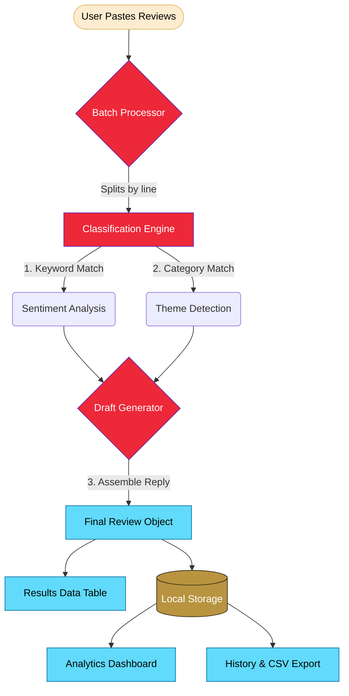

## 🌟 Overview

**Rev.AI** is an intelligent web application designed for **Trishul Eco-Homestays** staff to instantly analyze guest feedback across various booking platforms. Stop manually reading hundreds of reviews—paste them in, and let Rev.AI handle the rest.

### Instant Insights
- 🟢 **Sentiment** — Accurately tags reviews as Positive, Neutral, or Negative.
- 🏷️ **Theme** — Detects the core focus (Food, Host, Location, Cleanliness, Value, or Experience).
- 💬 **Smart Replies** — Automatically drafts a professional, context-aware management response ready to be posted.

---

## ✨ Core Features

- ⚡ **Lightning-Fast Batch Processing**: Paste multiple reviews (one per line) and analyze them simultaneously.
- 📊 **Interactive Analytics Dashboard**: Beautiful Chart.js visualizations including sentiment pie charts and theme distribution bar graphs.
- 🎨 **Premium UI Experience**: Fluid Light/Dark mode toggles, warm color palettes, and fully responsive layouts.
- 💾 **Persistent Review History**: All analyzed reviews are saved locally. Easily search, filter, and review past feedback.
- 📤 **One-Click Export**: Download any analysis results straight to a `.csv` file for external reporting.
- 📋 **Seamless Workflow**: One-click "Copy Response" buttons to quickly grab the generated AI reply.

---

## 🏗️ System Architecture & Data Flow



---

## 🚀 Getting Started

### Prerequisites
- **Node.js** ≥ 18.x
- **npm** ≥ 9.x

### Installation
```bash
# 1. Clone & Navigate
cd rev-ai/client

# 2. Install dependencies
npm install

# 3. Start development server (Runs on http://localhost:5173)
npm run dev
```

---

## 🧠 How the Engine Works

Currently functioning entirely in the frontend, Rev.AI uses a powerful **keyword-based NLP classifier**:

1. **Sentiment**: Weighs ~115 positive/negative keywords to determine a final ratio score.
2. **Themes**: Checks against 6 specialized dictionaries (e.g., `breakfast` triggers 🍽️ Food; `spotless` triggers ✨ Cleanliness).
3. **Responses**: Context-aware selection from 54 carefully crafted templates (e.g., apologizes for Negative+Cleanliness; expresses gratitude for Positive+Host).

---

## 📈 Test Report Summary

Tested against **20 simulated guest reviews** covering a wide array of edge cases.

- **Sentiment Accuracy:** 100%
- **Theme Detection Accuracy:** 100%
- **All Features (Batch, Dashboard, CSV Export):** ✅ Pass

> *Read the full breakdown in [`test-report.md`](./test-report.md)*

---

## 🗺️ Project Roadmap

- [x] **Phase 1 (Current):** Complete Frontend (React + Vite), UI/UX, Local NLP Engine, Charts, and Local Storage.
- [ ] **Phase 2 (Planned):** Node.js Backend, MongoDB Integration, and **Google Gemini API** integration for deeper semantic AI understanding.
- [ ] **Phase 3 (Future):** User authentication, email alerts for negative reviews, and PDF report generation.

---
<div align="center">
  <i>Built with ❤️ using React, Vite, and Chart.js</i><br/>
  <strong>Rev.AI — Turning guest feedback into actionable insights.</strong>
</div>
