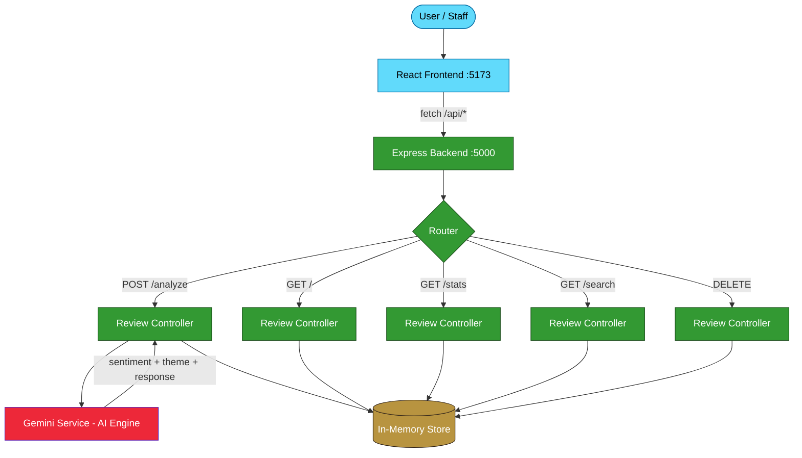

<div align="center">

# 🤖 Rev.AI

### AI-Powered Guest Review Analysis System for Homestays

[](https://nodejs.org/)
[](https://react.dev/)
[](https://expressjs.com/)
[](./client/LICENSE)

**Paste guest reviews → Get instant sentiment analysis, theme detection, and AI-generated management responses.**

---

</div>

## 🌟 Overview

**Rev.AI** is a full-stack web application built for **Trishul Eco-Homestays** staff to instantly analyze guest feedback. Instead of manually reading hundreds of reviews, paste them in and Rev.AI classifies sentiment, detects themes, and drafts professional responses — all in seconds.

### What It Does

| Feature | Description |
|---------|-------------|
| 🟢 **Sentiment Analysis** | Classifies each review as **Positive**, **Neutral**, or **Negative** |
| 🏷️ **Theme Detection** | Identifies the primary theme: Food, Host, Location, Cleanliness, Value, or Experience |
| 💬 **AI-Generated Responses** | Drafts professional, context-aware management replies |
| ⚡ **Batch Processing** | Analyze multiple reviews at once (one per line) |
| 📊 **Analytics Dashboard** | Interactive pie charts & bar graphs via Chart.js |
| 🕐 **Review History** | Browse, search, and filter all past analyses |
| 📤 **CSV Export** | Download results for external reporting |
| 🌗 **Dark/Light Mode** | Premium UI with theme toggle |

---

## 🏗️ Tech Stack

| Layer | Technology | Purpose |
|-------|-----------|---------|
| **Frontend** | React 19 + Vite | SPA with modern responsive UI |
| **Backend** | Node.js + Express.js | REST API server |
| **Database** | In-Memory (MongoDB planned) | Data persistence |
| **AI Engine** | Keyword NLP (Gemini API planned) | Sentiment & theme analysis |
| **Charts** | Chart.js + react-chartjs-2 | Dashboard visualizations |
| **Icons** | Lucide React | UI iconography |
| **Routing** | React Router v7 | Client-side navigation |

---

## 📁 Project Structure

```
rev-ai/
│
├── client/                          # React.js Frontend (Vite)
│   ├── public/                      # Static assets
│   ├── src/
│   │   ├── components/
│   │   │   ├── Dashboard.jsx        # Analytics dashboard with charts
│   │   │   ├── Navbar.jsx           # Navigation bar with theme toggle
│   │   │   ├── ResultsTable.jsx     # Analysis results table
│   │   │   └── ReviewForm.jsx       # Review input form
│   │   ├── context/
│   │   │   └── ThemeContext.jsx      # Dark/Light mode context
│   │   ├── pages/
│   │   │   ├── Home.jsx             # Main review analysis page
│   │   │   └── History.jsx          # Review history with search/filter
│   │   ├── services/
│   │   │   └── api.js               # API service layer (fetch calls)
│   │   ├── App.jsx                  # Root component with routes
│   │   ├── main.jsx                 # Entry point
│   │   └── index.css                # Global styles & design system
│   ├── vite.config.js               # Vite config with API proxy
│   └── package.json
│
├── server/                          # Node.js Backend (Express.js)
│   ├── config/
│   │   └── db.js                    # In-memory data store
│   ├── controllers/
│   │   └── reviewController.js      # Request handlers (7 endpoints)
│   ├── models/
│   │   └── Review.js                # Review data model & validation
│   ├── routes/
│   │   └── reviewRoutes.js          # Express Router definitions
│   ├── services/
│   │   └── geminiService.js         # AI analysis engine
│   ├── server.js                    # Express app entry point
│   ├── .env                         # Environment variables
│   └── package.json
│
└── README.md
```

---

## 🚀 Getting Started

### Prerequisites

- **Node.js** ≥ 18.x
- **npm** ≥ 9.x

### Installation & Setup

```bash
# 1. Clone the repository
git clone https://github.com/your-username/rev-ai.git
cd rev-ai

# 2. Install backend dependencies
cd server
npm install

# 3. Install frontend dependencies
cd ../client
npm install
```

### Configure Environment Variables

Create or edit `server/.env`:

```env
PORT=5000
GEMINI_API_KEY=your_gemini_api_key_here
```

### Run the Application

Open **two terminals**:

```bash
# Terminal 1 — Start Backend (http://localhost:5000)
cd server
npm run dev

# Terminal 2 — Start Frontend (http://localhost:5173)
cd client
npm run dev
```

> The Vite dev server automatically proxies all `/api` requests to the Express backend.

---

## 📡 REST API Reference

**Base URL:** `http://localhost:5000/api`

### Endpoints (7 Total)

| # | Method | Endpoint | Description | Status Codes |
|---|--------|----------|-------------|--------------|
| 1 | `POST` | `/api/reviews/analyze` | Submit & analyze reviews (batch) | `201`, `400` |
| 2 | `GET` | `/api/reviews` | Get all review history | `200` |
| 3 | `GET` | `/api/reviews/stats` | Get dashboard statistics | `200` |
| 4 | `GET` | `/api/reviews/search` | Search & filter reviews | `200`, `400` |
| 5 | `GET` | `/api/reviews/:id` | Get a single review by ID | `200`, `404` |
| 6 | `DELETE` | `/api/reviews/:id` | Delete a single review | `204`, `404` |
| 7 | `DELETE` | `/api/reviews` | Clear all review history | `204` |

**Bonus:** `GET /api/health` — Server health check

---

### API Usage Examples

#### 1. Analyze Reviews

```bash
POST /api/reviews/analyze
Content-Type: application/json

{
  "reviews": [
    "The food was amazing and the host was very friendly!",
    "Terrible experience. Room was dirty and staff was rude.",
    "Room was okay. Location was nice though."
  ]
}
```

**Response (201 Created):**
```json
{
  "success": true,
  "count": 3,
  "data": [
    {
      "id": "uuid-here",
      "reviewText": "The food was amazing and the host was very friendly!",
      "sentiment": "positive",
      "theme": "host",
      "themeIcon": "👤",
      "response": "Thank you for recognizing our team's hospitality!...",
      "analyzedAt": "2026-06-29T05:04:25.639Z"
    }
  ]
}
```

#### 2. Search & Filter

```bash
GET /api/reviews/search?q=food&sentiment=positive&theme=food
```

#### 3. Dashboard Stats

```bash
GET /api/reviews/stats
```

**Response (200 OK):**
```json
{
  "success": true,
  "data": {
    "total": 12,
    "sentimentCounts": { "positive": 7, "neutral": 3, "negative": 2 },
    "themeCounts": { "food": 3, "host": 4, "location": 2, "cleanliness": 1, "value": 1, "experience": 1 }
  }
}
```

---

### Error Handling

All errors return a consistent JSON format:

```json
{
  "success": false,
  "error": "Descriptive error message here"
}
```

| Status Code | Meaning | When |
|-------------|---------|------|
| `200` | OK | Successful read operations |
| `201` | Created | Reviews analyzed & stored |
| `204` | No Content | Successful deletion |
| `400` | Bad Request | Invalid input or missing fields |
| `404` | Not Found | Review ID doesn't exist |
| `500` | Server Error | Unexpected internal error |

---

## 🧠 How the Analysis Engine Works

The current engine uses a **keyword-based NLP classifier** (to be upgraded to Gemini API):

```
                    ┌──────────────────────────┐
                    │     Review Text Input     │
                    └────────────┬─────────────┘
                                 │
              ┌──────────────────┼──────────────────┐
              ▼                  ▼                   ▼
     ┌────────────────┐ ┌───────────────┐ ┌──────────────────┐
     │   Sentiment    │ │    Theme      │ │    Response      │
     │   Classifier   │ │   Detector    │ │   Generator      │
     │                │ │               │ │                  │
     │ 115+ keywords  │ │ 6 keyword     │ │ 54 templates     │
     │ pos/neg ratio  │ │ dictionaries  │ │ per sentiment ×  │
     │ → threshold    │ │ → top score   │ │ theme combo      │
     └───────┬────────┘ └───────┬───────┘ └────────┬─────────┘
             │                  │                   │
             └──────────────────┼───────────────────┘
                                ▼
                    ┌──────────────────────────┐
                    │   Complete Analysis      │
                    │   { sentiment, theme,    │
                    │     response, date }     │
                    └──────────────────────────┘
```

1. **Sentiment:** Scores ~115 positive/negative keywords, calculates ratio → Positive (≥65%), Negative (≤35%), or Neutral.
2. **Themes:** Matches against 6 specialized dictionaries (e.g., `breakfast` → 🍽️ Food, `spotless` → ✨ Cleanliness).
3. **Responses:** Selects from 54 crafted templates based on sentiment × theme combination.

---

## 🏗️ System Architecture



---

## 📈 Test Results

All 7 API endpoints tested and verified:

| Endpoint | Method | Expected | Actual | Status |
|----------|--------|----------|--------|--------|
| `/api/reviews/analyze` | POST | 201 | 201 | ✅ Pass |
| `/api/reviews` | GET | 200 | 200 | ✅ Pass |
| `/api/reviews/stats` | GET | 200 | 200 | ✅ Pass |
| `/api/reviews/search` | GET | 200 | 200 | ✅ Pass |
| `/api/reviews/:id` | GET | 200/404 | 200/404 | ✅ Pass |
| `/api/reviews/:id` | DELETE | 204/404 | 204/404 | ✅ Pass |
| `/api/reviews` | DELETE | 204 | 204 | ✅ Pass |
| Empty body validation | POST | 400 | 400 | ✅ Pass |

---

## 🗺️ Project Roadmap

- [x] **Phase 1:** React Frontend — UI/UX, components, charts, routing, dark mode
- [x] **Phase 2:** Express.js Backend — 7 REST APIs, in-memory data, error handling, frontend integration
- [ ] **Phase 3:** MongoDB + Mongoose — Replace in-memory store with persistent database
- [ ] **Phase 4:** Gemini API Integration — Real AI-powered analysis replacing keyword engine
- [ ] **Phase 5:** Deployment — Frontend (Vercel), Backend (Render), Database (MongoDB Atlas)
- [ ] **Phase 6:** Auth & Advanced — User login, email alerts for negative reviews, PDF reports

---

## 🛠️ Scripts Reference

### Backend (`server/`)
```bash
npm start          # Start server with Node
npm run dev        # Start server with Nodemon (auto-reload)
```

### Frontend (`client/`)
```bash
npm run dev        # Start Vite dev server
npm run build      # Production build
npm run preview    # Preview production build
npm run lint       # Run ESLint
```

---

## 📦 Dependencies

### Backend
| Package | Version | Purpose |
|---------|---------|---------|
| express | ^4.21 | Web framework |
| cors | ^2.8 | Cross-origin resource sharing |
| dotenv | ^16.4 | Environment variable management |
| uuid | ^11.1 | Unique ID generation |
| nodemon | ^3.1 | Dev auto-reload (devDep) |

### Frontend
| Package | Version | Purpose |
|---------|---------|---------|
| react | ^19.2 | UI library |
| react-dom | ^19.2 | React DOM rendering |
| react-router-dom | ^7.17 | Client-side routing |
| chart.js | ^4.5 | Chart visualizations |
| react-chartjs-2 | ^5.3 | React Chart.js wrapper |
| lucide-react | ^1.18 | Icon library |

---

<div align="center">

**Built with ❤️ using React, Express.js, and Chart.js**

**Rev.AI — Turning guest feedback into actionable insights.**

</div>
