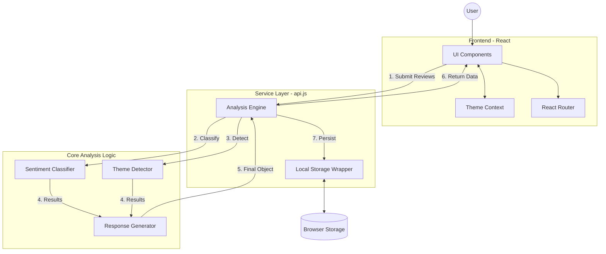
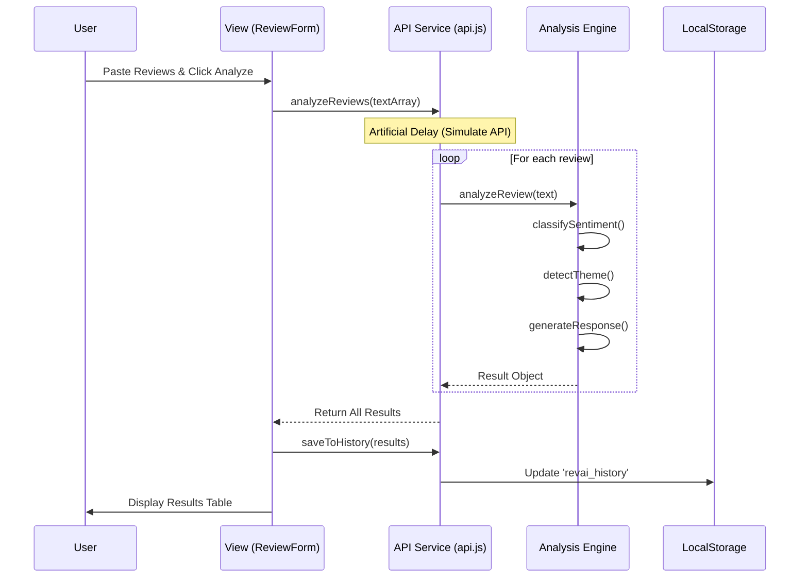
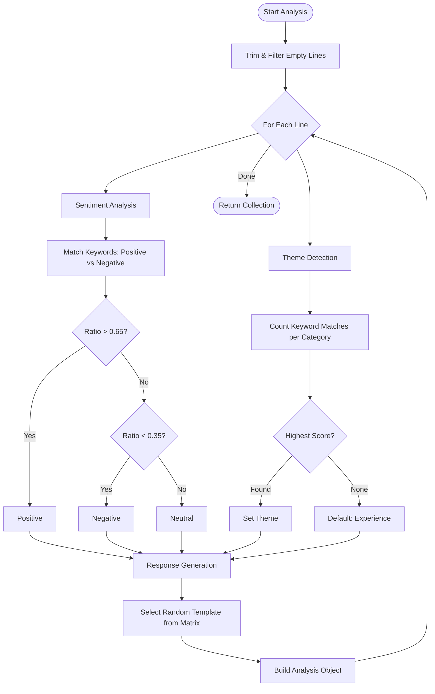
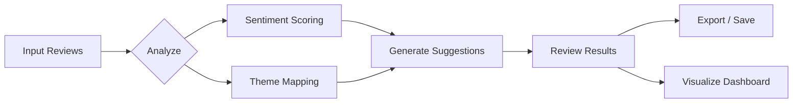

# Rev.AI 🚀


[](https://reactjs.org/)
[](https://vitejs.dev/)
[](https://www.chartjs.org/)

**Rev.AI** is an intelligent guest review analysis platform designed for homestays and hotels. It leverages mock AI logic (ready for Gemini API integration) to transform raw guest feedback into actionable insights, sentiment classification, and professional management responses.

---

## 🌟 Key Features

- **🔍 Intelligent Analysis**: Automatically classifies reviews into *Positive*, *Neutral*, or *Negative* sentiments.
- **🏷️ Theme Detection**: Categorizes feedback into key areas: *Food, Host, Location, Cleanliness, Value, or Experience*.
- **✍️ AI-Powered Responses**: Generates tailored, professional management responses based on the review's tone and theme.
- **📊 Interactive Dashboard**: Visualizes feedback trends using dynamic charts (Doughnut & Bar) powered by Chart.js.
- **⚡ Batch Processing**: Analyze multiple reviews simultaneously by pasting them in a list format.
- **💾 Persistent History**: Automatically saves analysis results to local storage for future reference.
- **📥 CSV Export**: Download analysis data in CSV format for further reporting.

---

## 📸 App Preview

> **Note**: Add your own screenshots here to showcase the UI.

| Dashboard View | Analysis Results |
| :---: | :---: |
|  |  |

---

## 🏗️ System Architecture

### Component Interaction
The following diagram illustrates the high-level architecture and data flow:



### Analysis Sequence
Detailed interaction when a user triggers the analysis:



---

## 🔄 Logic Flow

Detailed decision-making process for the mock AI engine:



---

## 🔄 User Workflow
A streamlined process to go from raw text to professional management:



---

## 🛠️ Tech Stack

- **Framework**: [React 19](https://react.dev/)
- **Bundler**: [Vite 8](https://vitejs.dev/)
- **Icons**: [Lucide React](https://lucide.dev/)
- **Charts**: [Chart.js](https://www.chartjs.org/) with [react-chartjs-2](https://react-chartjs-2.js.org/)
- **Routing**: [React Router 7](https://reactrouter.com/)
- **Styling**: Modern CSS3 (Custom Variables & Animations)

---

## 🚀 Getting Started

### Prerequisites

- [Node.js](https://nodejs.org/) (v18.0.0 or higher)
- npm or yarn

### Installation

1. **Clone the repository**
   ```bash
   git clone https://github.com/your-username/rev-ai.git
   cd rev-ai/client
   ```

2. **Install dependencies**
   ```bash
   npm install
   ```

3. **Start the development server**
   ```bash
   npm run dev
   ```

4. **Open in browser**
   Navigate to `http://localhost:5173`

---

## 📁 Project Structure

```text
src/
├── components/   # Reusable UI components (Dashboard, Forms, Navbar)
├── context/      # Global state (ThemeContext)
├── pages/        # Main application pages (Home, History)
├── services/     # Core logic (Mock AI Engine, Storage Utilities)
├── App.jsx       # Routing and layout
└── main.jsx      # Entry point
```

---

## 🔮 Future Roadmap

- [ ] **Real AI Integration**: Connect to Google Gemini API for advanced NLP.
- [ ] **Multi-Language Support**: Support for analysis in various languages.
- [ ] **Advanced Analytics**: Deeper correlation charts and trend analysis over time.
- [ ] **Authentication**: User accounts and cloud-based history sync.

---

## 📄 License

This project is licensed under the MIT License - see the LICENSE file for details.

---
*Built with ❤️ for better guest experiences.*
